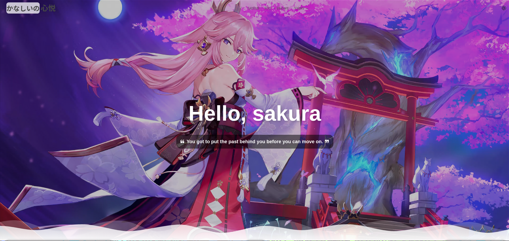

<h2 align="center">Valaxy Theme Sakura</h2>
<pre align="center">
🧪 正在积极开发中 | <a href="https://sakura.wrxinyue.org/">Live Demo</a> 🌸
</pre>

### 使用

**安装主题:**
~~~bash
# pnpm (推荐)
pnpm create valaxy

# 如果没有pnpm使用 npm install -g pnpm 来进行安装
# npm
# npm init valaxy
# yarn
# yarn create valaxy
pnpm add valaxy-theme-sakura
~~~

**启用主题:**
~~~ts
// valaxy.config.ts
import { defineConfig } from 'valaxy'
import type { ThemeUserConfig } from 'valaxy-theme-sakura'

export default defineValaxyConfig<ThemeUserConfig>({
  theme: 'sakura'
})
~~~

**配置示例:**
~~~ts
// valaxy.config.ts
import { defineValaxyConfig } from 'valaxy'
import type { ThemeUserConfig } from 'valaxy-theme-sakura'

// add icons what you will need
const safelist = [
  'i-ri-home-line',
]

/**
 * User Config
 */
export default defineValaxyConfig<ThemeUserConfig>({
  // site config see site.config.ts

  theme: 'sakura',

  themeConfig: {
    // colors: {
    //   primary: 'red',
    // },

    prefixName: 'かなしいの',
    siteName: '心悦',

    homeTitle: 'Hello, sakura',
    homeMotto: 'You got to put the past behind you before you can move on.',

    favicon: false, // 导航栏图标

    headerWallpaper: {
      // 壁纸类型:
      // - 'video': 视频
      // - 'image': 图片
      type: 'video',
      // 图片壁纸链接
      imageUrl: 'https://wrxinyue-images.s3.bitiful.net/pc-wallpaper/wallhaven-yxwy7k.jpg',
      // 视频壁纸链接
      videoUrl: 'https://wrxinyue-images.s3.bitiful.net/wallpaper/Genshin Impact - Yae Miko (4) Cybust PC.mp4',

      // 背景样式选项:
      // - '': 无特效，显示原图
      // - 'filter-dim': 阴影效果
      // - 'filter-grid': 横条效果
      // - 'filter-dot': 点点效果
      backgroundStyle: 'filter-dot',
    },

    // 导航栏
    nav: [
      {
        text: 'GitHub',
        link: 'https://github.com/WRXinYue/valaxy-theme-sakura',
      },
      {
        text: 'RSS',
        link: '/atom.xml',
      },
      {
        text: 'Discord',
        link: 'https://discord.gg/sGe4U4p4CK',
      },
      {
        text: 'Valaxy →',
        link: 'https://github.com/YunYouJun/valaxy',
      },
    ],

    // 页脚配置
    footer: {
      since: 2024,

      icon: {
        img: '/favicon.ico',
        animated: true,
        url: 'https://wrxinyue.org',
        title: 'WRXinYue',
      },
    },
  },

  unocss: { safelist },
})
~~~

**更新主题：**
~~~bash
pnpm up valaxy-theme-sakura --latest
# npm update valaxy-theme-sakura
~~~

### 鸣谢

- [云游君(云猫猫)](https://valaxy.site/)
- [樱花庄的白猫博客主题](https://github.com/mashirozx/sakura)
- [hexo-theme-sakura](https://github.com/honjun/hexo-theme-sakura)
- [vitepress-theme-sakura](https://github.com/flaribbit/vitepress-theme-sakura)
